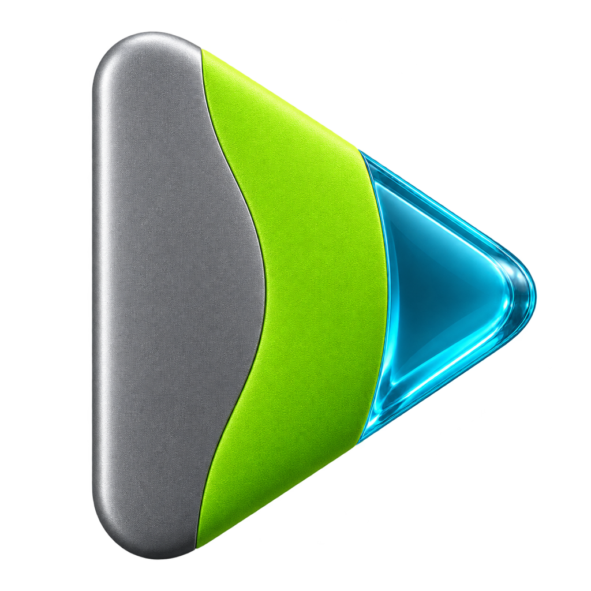

# VeloEdit

Видеоредактор для macOS с локальным AI.

Здесь доступны исходники для ознакомления и готовые установщики VeloEdit.

## Скачать

[Скачать VeloEdit для macOS](https://github.com/007danlin/VeloEdit/releases)

Откройте последний релиз и скачайте файл `.dmg` в разделе Assets.

## Требования

- macOS 14 или новее
- Mac с Apple Silicon или Intel

## Установка

1. Откройте скачанный DMG.
2. Перенесите VeloEdit в «Программы».
3. Запустите приложение.

Текущая бета-версия не прошла нотарификацию Apple.
Если macOS блокирует запуск, откройте:
«Системные настройки → Конфиденциальность и безопасность → Всё равно открыть».

## Сторонние компоненты

Используются OVRLEY и FFmpeg.
Лицензии и сведения о компонентах доступны внутри приложения.

Собственный код и ресурсы VeloEdit принадлежат Daniel L и предоставлены для
ознакомления на условиях [LICENSE.txt](LICENSE.txt). Публичный доступ не означает
разрешение перепубликовывать приложение, продавать его копии или распространять
производные версии. Права просмотра и fork по условиям GitHub сохраняются.
Сторонние компоненты, включая GPL-код OVRLEY, сохраняют свои лицензии.

GPL не распространяется автоматически на созданное пользователем видео.
При экспорте без музыки с обязательной атрибуцией отдельный файл лицензий не
создаётся. Для треков с обязательной атрибуцией сохраняется `music-credits.json`:
указанные сведения нужно использовать при публикации согласно условиям трека.

## Разработка

[Документация](Docs/README.md) · [Сборка и тесты](Docs/Guides/development.md) · [Архитектура](Docs/Architecture/overview.md) ·
[Подготовка выпуска и проверки лицензий](Docs/Guides/release.md)

Полная сборка приложения: `./Scripts/build-app.sh`.

| Папка | Содержимое |
| --- | --- |
| `Sources/` | Код приложения, ядра и CLI |
| `Resources/` | Ресурсы, которые входят в приложение |
| `Tests/` | Тесты |
| [Docs/](Docs/README.md) | Архитектура, функции, ТЗ, планы и инструкции |
| [Scripts/](Scripts/README.md) | Сборка, проверки, замеры и эксперименты |
| [Design/](Design/README.md) | Исходники графики и варианты иконок |
| `Distribution/`, `ThirdParty/` | Настройки распространения и сторонние компоненты |
| [website/](website/README.md) | Сайт проекта |

Локальные отчёты и аудиты хранятся в `Local/Reports/`, замеры — в
`Local/Benchmarks/`. Вся папка `Local/`, результаты сборки в `Build/` и
экспериментов в `output/` исключены из Git и не попадают в обычный `git add`
и push. В новом clone локальных отчётов нет; прежние опубликованные версии
доступны в истории Git.

## Скриншоты

